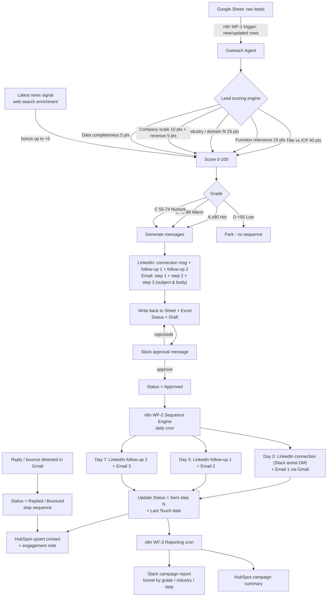

# Outreach Agent — System Orchestration & Architecture

AI-powered outbound system for selling **AI solutions that plug into ERP software for
small, high-value use cases across retail ecosystems** (retail, apparel, food &
beverages, textiles, food production, consumer goods).

The system reads leads from Google Sheets, scores each lead against the ICP
(CEO / CFO / CTO / COO / Founder / VP / Director / Operations & Supply-Chain
leaders), enriches with latest company news, generates a personalized
**LinkedIn connection message + 2 follow-ups** and a **3-step email sequence**,
writes everything back into an Excel/Sheets workbook with `Lead Score` and
`Status` columns, runs the send automation through **self-hosted n8n** on your
local server, syncs contacts to **HubSpot**, and reports campaign performance
to **Slack**.

---

## 1. High-level orchestration

```
                        ┌────────────────────────── LOCAL SERVER (Docker) ──────────────────────────┐
                        │                                                                            │
 Google Sheet           │   ┌──────────────┐        ┌───────────────────┐       ┌────────────────┐  │
 (raw leads) ──────────▶│   │  n8n WF-1    │───────▶│  Outreach Agent   │──────▶│  n8n WF-2      │  │
                        │   │ Lead Intake  │        │ (Claude API)      │       │ Sequence Engine│  │
                        │   │ & Scoring    │        │ score + messages  │       │ (cron, steps   │  │
                        │   └──────┬───────┘        └────────┬──────────┘       │  0 / 3 / 7)    │  │
                        │          │                         │                  └───┬───────┬────┘  │
                        │          │ news enrichment         │ writes back          │       │       │
                        │          ▼ (web search)            ▼                      ▼       ▼       │
                        │   ┌──────────────┐        ┌───────────────────┐      ┌───────┐ ┌───────┐  │
                        │   │ News Signal  │        │ Sheet + Excel     │      │ Gmail │ │ Slack │  │
                        │   └──────────────┘        │ (score, msgs,     │      │ SMTP  │ │ (LI   │  │
                        │                           │  status columns)  │      └───────┘ │ assist│  │
                        │   ┌──────────────┐        └───────────────────┘                │  DM)  │  │
                        │   │  n8n WF-3    │                                             └───────┘  │
                        │   │  Reporting   │────▶ Slack #outreach-reports  +  HubSpot sync          │
                        │   └──────────────┘                                                        │
                        └────────────────────────────────────────────────────────────────────────────┘
```

### Components

| Component | Role | Runs on |
|---|---|---|
| **Outreach Agent** (`outreach_agent/` Python package) | Lead scoring, persona classification, message generation (Claude API or offline template engine), Excel workbook build, reporting | Local server (Docker container or bare Python) |
| **n8n WF-1 — Lead Intake & Scoring** | Watches the Google Sheet for new rows, calls the agent / Claude API, enriches with latest news, writes score + messages back, posts approval request to Slack | Self-hosted n8n |
| **n8n WF-2 — Sequence Engine** | Daily cron; advances every `Approved` lead through the 3-step LinkedIn + email cadence (Day 0 / 3 / 7), sends emails via Gmail, DMs you the LinkedIn message to send (LinkedIn has no compliant messaging API), updates `Status` and syncs HubSpot | Self-hosted n8n |
| **n8n WF-3 — Campaign Reporting** | Daily/weekly cron; aggregates funnel metrics from the sheet, posts a Slack report, logs a campaign summary in HubSpot | Self-hosted n8n |
| **Google Sheet / Excel workbook** | System of record: leads + Lead Score + Lead Grade + all 6 messages + Status (`Draft → Approved → Sent …`) + Campaign Report tab | Google / local file |
| **HubSpot** | CRM mirror: contacts upserted with score, lifecycle stage, engagement notes | Cloud |
| **Slack** | Human-in-the-loop approvals, LinkedIn send-assist DMs, campaign reports | Cloud |

---

## 2. Workflow diagram (end-to-end)



### Sequence cadence

| Step | Day | LinkedIn | Email |
|---|---|---|---|
| 1 | 0 | Connection request (≤300 chars, personalized hook) | Email 1 — pain-point opener + specific ERP/AI use case |
| 2 | 3 | Follow-up 1 — value story / mini case study | Email 2 — proof point + soft CTA (15-min call) |
| 3 | 7 | Follow-up 2 — courteous breakup + open door | Email 3 — breakup email + resource link |

Sequence stops immediately on **Replied**, **Bounced**, or **Do Not Contact**.

---

## 3. Lead scoring model

`Lead Score = min(100, ICP + Function + Industry + Scale + Revenue + Completeness + News)`

| Signal | Max | Logic |
|---|---|---|
| **ICP title tier** | 40 | Tier 1 (CEO, CFO, CTO, COO, CIO, Founder, Co-Founder, MD, President, Owner, Chairman) = 40 · Tier 2 (EVP/SVP/VP/AVP, off-center C-suite e.g. CMO) = 30 · Tier 3 (Director, Head of, GM) = 24 · Tier 4 (Manager/Lead in a relevant function) = 12 · other = 5 |
| **Function relevance** | 15 | Operations, supply chain, IT/digital/tech, finance, procurement, merchandising, e-commerce, planning = 15 · general management = 13 · sales/marketing = 5 · HR/legal/medical/other = 2 |
| **Industry / domain fit** | 25 | Core retail ecosystem (retail, apparel & fashion, food & beverages, consumer goods, supermarkets, restaurants, luxury) = 25 · adjacent supply side (food production, farming, textiles, furniture, manufacturing) = 16 · other = 6 |
| **Company scale** | 10 | 500–20,000 employees (pilot-friendly mid-market) = 10 · 200–499 or 20k–100k = 7 · >100k = 5 · 50–199 = 3 · unknown/<50 = 1–2 |
| **Revenue** | 5 | $100M–$2B = 5 · ≥ $2B = 4 (longer cycles) · ≥ $10M = 3 · else 1 |
| **Data completeness** | 5 | Valid email +3, personal LinkedIn URL +2 |
| **News signal** | +5 bonus | Recent expansion / digital transformation / ERP or tech investment news (populated by n8n web-search enrichment; blank when offline) |

Grades: **A (Hot) ≥ 90 · B (Warm) 75–89 · C (Nurture) 55–74 · D (Low) < 55**.
Only A/B/C enter the sequence; D is parked for review.

---

## 4. API requirements

See [API_REQUIREMENTS.md](API_REQUIREMENTS.md) for the full matrix (auth,
scopes, endpoints, rate limits, env vars).

Summary:

| API | Used for | Auth |
|---|---|---|
| Anthropic Messages API (`claude-sonnet-5` / `claude-haiku-4-5`) | Persona analysis, message generation, news summarization (web search tool) | `ANTHROPIC_API_KEY` |
| Google Sheets API v4 | Read leads, write score/message/status columns | OAuth2 (Desktop) or service account |
| Gmail API (`gmail.send`, `gmail.readonly`) | Send email steps, detect replies/bounces | Same Google OAuth |
| Slack Web API (`chat.postMessage`, Block Kit) | Approvals, LinkedIn send-assist, reports | Bot token `xoxb-…` |
| HubSpot CRM v3 (`crm.objects.contacts`, notes) | Contact upsert, engagement log, campaign summary | Private-app token |
| n8n REST / webhooks | Workflow triggers between components | `N8N_API_KEY`, basic auth on UI |
| LinkedIn | **No compliant messaging API** — messages are generated and delivered to you via Slack for 1-click manual send (safe; avoids account bans) | n/a |

---

## 5. Hosting on your local server

Everything self-hostable runs in Docker (see `docker-compose.yml`):

```
docker compose up -d      # starts n8n (port 5678) + the outreach agent container
```

- **n8n**: `n8nio/n8n` image, persisted volume, basic-auth protected, timezone-aware
  crons. Import the three workflow JSONs from `n8n/`.
- **outreach-agent**: Python container exposing a tiny CLI; n8n calls it with
  `Execute Command` / HTTP, or you run it manually:
  `python -m outreach_agent.cli run --input data/leads.csv --out output/outreach_campaign.xlsx`
- Secrets live in `.env` (never committed) — template in `.env.example`.
- For Google Sheet access from the local server use a **service account** shared
  on the sheet (no interactive OAuth needed on a headless box).

## 6. Human-in-the-loop & compliance guardrails

1. Nothing is sent until a human flips `Status` to **Approved** (via Slack button or directly in the sheet).
2. LinkedIn messages are never auto-sent — automated LinkedIn messaging violates the LinkedIn User Agreement; the system prepares the message and DMs it to you for one-click manual sending.
3. Every email includes an opt-out line; `Do Not Contact` status is honored permanently.
4. Sequence stops on reply/bounce automatically.
5. Daily send caps (default 30 emails/day) to protect sender reputation.
